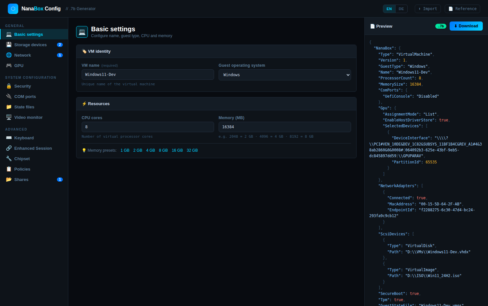
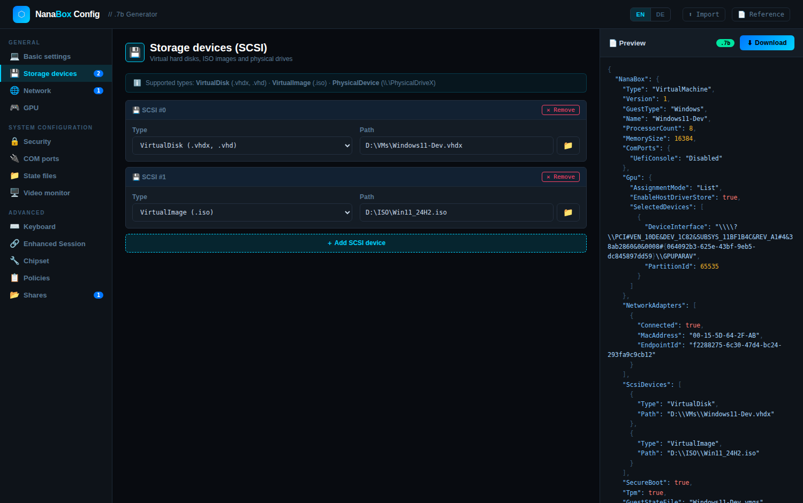
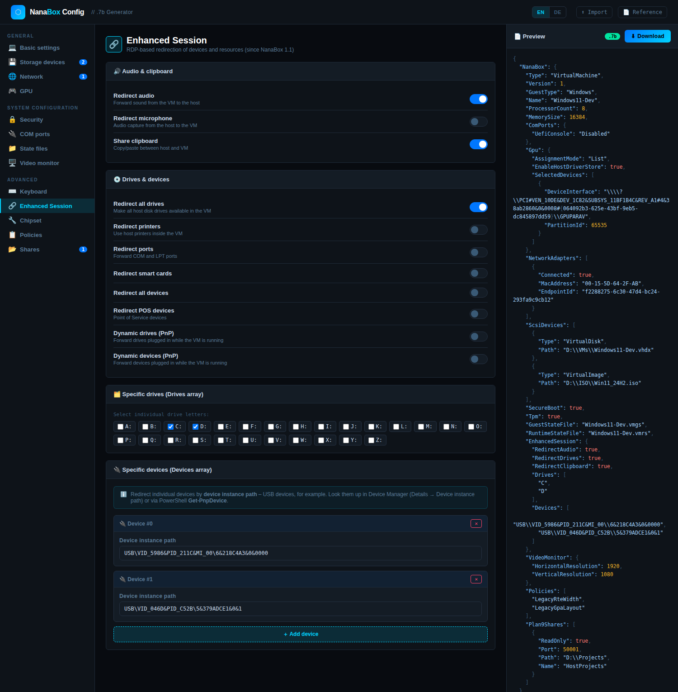
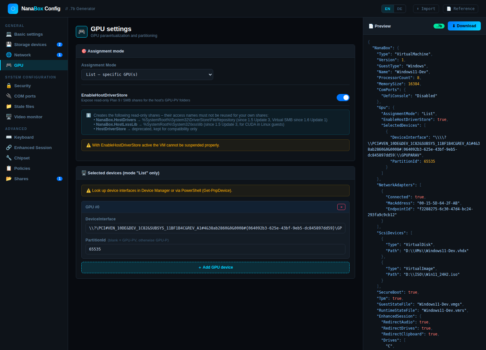
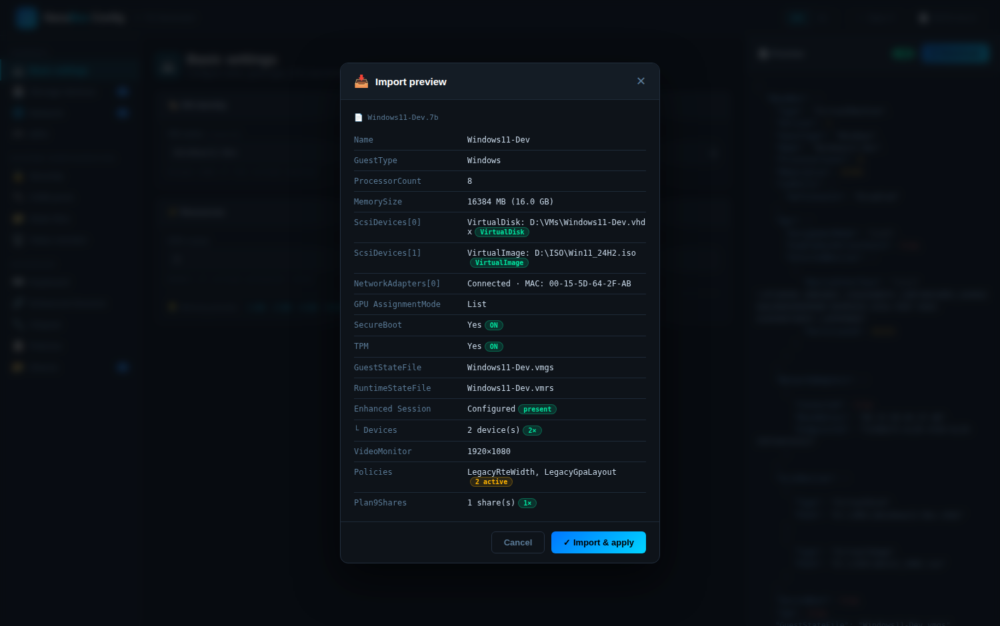
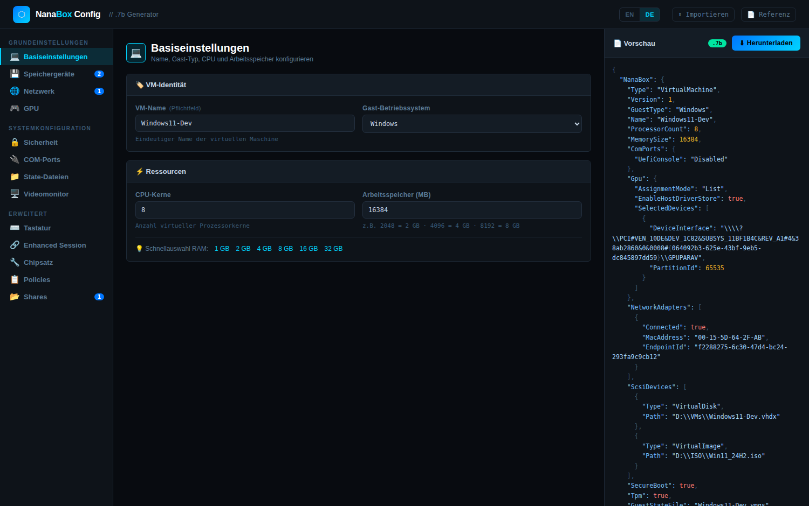

# NanaBox Config Generator

**English** · [Deutsch ↓](#deutsch)

A web-based configuration file generator for [NanaBox](https://github.com/M2Team/NanaBox) `.7b` virtual machine configuration files. The interface is available in **English and German** — switch with the EN/DE toggle in the header.

Covers the full configuration reference as of **NanaBox 1.6 Update 5**.

🔗 **Live:** https://dmatrix68-boop.github.io/nanabox-config/

## Features

- **Live preview** – JSON output with syntax highlighting updates as you type
- **Import** – drag & drop or file picker for existing `.7b` files, with a summary before anything is applied
- **Download** – writes UTF-8 BOM encoded `.7b` files as required by NanaBox
- **Bilingual UI** – English (default) and German, remembered across visits
- **Lossless round-trip** – imported values are preserved on export, including policies this generator does not know yet
- **Validation hints** – warns when a share `Name` collides with an access name NanaBox reserves for `EnableHostDriverStore`

## Screenshots

### Storage devices

Virtual disks, ISO images and physical drives, with a file browser on each path field.

### Enhanced Session — including the `Devices` array

All redirect flags, per-drive selection (A–Z) and per-device redirection by device instance path.

### GPU — GPU-PV and GPU-P

Assignment mode, `EnableHostDriverStore` with its reserved share names, and per-device `PartitionId` for GPU partitioning.

### Import preview

Every `.7b` file is summarised before it replaces the current form.

### German interface

## Covered Configuration Sections

| Section | Fields |
|---|---|
| **Basic** | Name, GuestType, ProcessorCount, MemorySize |
| **SCSI Devices** | VirtualDisk, VirtualImage, PhysicalDevice – with file browser |
| **Network Adapters** | MAC, EndpointId, Switch (ID/Name/Subnet), Connected |
| **GPU** | AssignmentMode (Disabled/Default/Mirror/List), EnableHostDriverStore, SelectedDevices |
| **Security** | SecureBoot, TPM 2.0, ExposeVirtualizationExtensions |
| **COM Ports** | UefiConsole, ComPort1, ComPort2 |
| **State Files** | GuestStateFile *(required)*, RuntimeStateFile *(required)*, SaveStateFile |
| **Video Monitor** | HorizontalResolution, VerticalResolution, DisableBasicSessionDpiScaling |
| **Keyboard** | RedirectKeyCombinations, all 9 virtual key code hotkeys |
| **Enhanced Session** | 11 redirect flags, per-drive selection (A–Z), per-device selection (`Devices`) |
| **Chipset / SMBIOS** | Manufacturer, ProductName, Version, Family, SKUNumber, SerialNumber, UUID, … |
| **Policies** | All 10 legacy/force flags (requires Windows 11 24H2+), plus unknown policies carried over from an import |
| **Shares** | Plan 9 shares *(1.5 Update 2)*, Virtual SMB shares *(1.6 Update 1)* |

## Notes

- `GuestStateFile` and `RuntimeStateFile` are **always written** to the output – NanaBox raises a *File not found* error if they are missing. If left blank they default to `<VM name>.vmgs` / `<VM name>.vmrs`.
- The file browser button on SCSI path fields uses the [File System Access API](https://developer.mozilla.org/en-US/docs/Web/API/File_System_Access_API) where available. Due to browser security restrictions only the file name is filled in – the full path has to be completed manually.
- `EnhancedSession.Devices` takes **device instance paths** (e.g. `USB\VID_5986&PID_211C&MI_00\6&218C4A3&0&0000`), obtainable from Device Manager (*Details → Device instance path*) or `Get-PnpDevice`.
- With `EnableHostDriverStore` enabled, NanaBox creates read-only shares named `NanaBox.HostDrivers`, `NanaBox.HostLxssLib` and the deprecated `HostDriverStore`. Your own shares must not reuse those names – the generator flags a collision.

## Reference

- [NanaBox Configuration Reference](https://github.com/M2Team/NanaBox/blob/main/Documents/ConfigurationReference.md)
- [NanaBox on GitHub](https://github.com/M2Team/NanaBox)

## License

MIT

---

# NanaBox Config Generator — Deutsch

[English ↑](#nanabox-config-generator) · **Deutsch**

Ein webbasierter Generator für [NanaBox](https://github.com/M2Team/NanaBox)-Konfigurationsdateien im Format `.7b`. Die Oberfläche ist in **Englisch und Deutsch** verfügbar – umschaltbar über den EN/DE-Schalter in der Kopfzeile.

Deckt die vollständige Konfigurationsreferenz mit Stand **NanaBox 1.6 Update 5** ab.

🔗 **Live:** https://dmatrix68-boop.github.io/nanabox-config/

## Funktionen

- **Live-Vorschau** – JSON-Ausgabe mit Syntaxhervorhebung, aktualisiert sich beim Tippen
- **Import** – Drag & Drop oder Dateiauswahl für vorhandene `.7b`-Dateien, mit Zusammenfassung vor dem Übernehmen
- **Download** – erzeugt `.7b`-Dateien als UTF-8 mit BOM, wie von NanaBox gefordert
- **Zweisprachige Oberfläche** – Englisch (Standard) und Deutsch, die Auswahl bleibt gespeichert
- **Verlustfreier Round-Trip** – importierte Werte bleiben beim Export erhalten, auch Policies, die dieser Generator noch nicht kennt
- **Validierungshinweise** – warnt, wenn ein Share-`Name` mit einem Access Name kollidiert, den NanaBox für `EnableHostDriverStore` reserviert

## Screenshots

### Speichergeräte

Virtuelle Festplatten, ISO-Images und physische Laufwerke, mit Dateibrowser an jedem Pfadfeld.

### Enhanced Session – inklusive `Devices`-Array

Alle Umleitungs-Flags, Auswahl einzelner Laufwerke (A–Z) und Umleitung einzelner Geräte per Device Instance Path.

### GPU – GPU-PV und GPU-P

Zuweisungsmodus, `EnableHostDriverStore` mit seinen reservierten Share-Namen und `PartitionId` je Gerät für GPU-Partitionierung.

### Import-Vorschau

Jede `.7b`-Datei wird zusammengefasst, bevor sie das aktuelle Formular ersetzt.

## Abgedeckte Konfigurationsbereiche

| Bereich | Felder |
|---|---|
| **Basis** | Name, GuestType, ProcessorCount, MemorySize |
| **SCSI-Geräte** | VirtualDisk, VirtualImage, PhysicalDevice – mit Dateibrowser |
| **Netzwerkadapter** | MAC, EndpointId, Switch (ID/Name/Subnetz), Connected |
| **GPU** | AssignmentMode (Disabled/Default/Mirror/List), EnableHostDriverStore, SelectedDevices |
| **Sicherheit** | SecureBoot, TPM 2.0, ExposeVirtualizationExtensions |
| **COM-Ports** | UefiConsole, ComPort1, ComPort2 |
| **State-Dateien** | GuestStateFile *(Pflicht)*, RuntimeStateFile *(Pflicht)*, SaveStateFile |
| **Videomonitor** | HorizontalResolution, VerticalResolution, DisableBasicSessionDpiScaling |
| **Tastatur** | RedirectKeyCombinations, alle 9 Virtual-Key-Code-Hotkeys |
| **Enhanced Session** | 11 Umleitungs-Flags, Laufwerksauswahl (A–Z), Geräteauswahl (`Devices`) |
| **Chipsatz / SMBIOS** | Manufacturer, ProductName, Version, Family, SKUNumber, SerialNumber, UUID, … |
| **Policies** | Alle 10 Legacy-/Force-Flags (benötigt Windows 11 24H2+), zusätzlich unbekannte Policies aus einem Import |
| **Shares** | Plan 9 Shares *(1.5 Update 2)*, Virtual SMB Shares *(1.6 Update 1)* |

## Hinweise

- `GuestStateFile` und `RuntimeStateFile` werden **immer** geschrieben – NanaBox meldet sonst *File not found*. Bleiben sie leer, wird `<VM-Name>.vmgs` bzw. `<VM-Name>.vmrs` verwendet.
- Der Dateibrowser an den SCSI-Pfadfeldern nutzt die [File System Access API](https://developer.mozilla.org/en-US/docs/Web/API/File_System_Access_API), sofern verfügbar. Aus Sicherheitsgründen liefert der Browser nur den Dateinamen – der vollständige Pfad muss manuell ergänzt werden.
- `EnhancedSession.Devices` erwartet **Device Instance Paths** (z.B. `USB\VID_5986&PID_211C&MI_00\6&218C4A3&0&0000`), zu finden im Geräte-Manager (*Details → Geräteinstanzpfad*) oder per `Get-PnpDevice`.
- Bei aktivem `EnableHostDriverStore` legt NanaBox die Readonly-Shares `NanaBox.HostDrivers`, `NanaBox.HostLxssLib` und das veraltete `HostDriverStore` an. Eigene Shares dürfen diese Namen nicht verwenden – der Generator weist auf eine Kollision hin.

## Referenz

- [NanaBox Configuration Reference](https://github.com/M2Team/NanaBox/blob/main/Documents/ConfigurationReference.md)
- [NanaBox auf GitHub](https://github.com/M2Team/NanaBox)

## Lizenz

MIT
